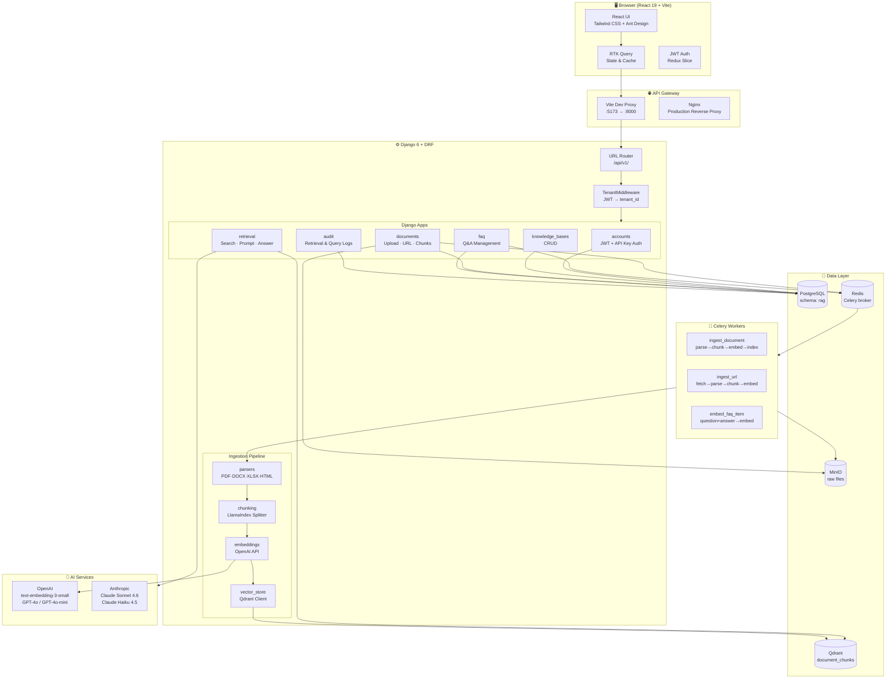
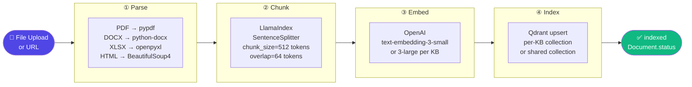
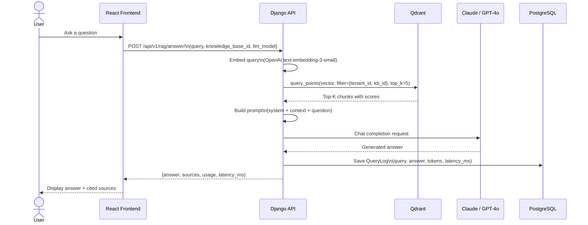
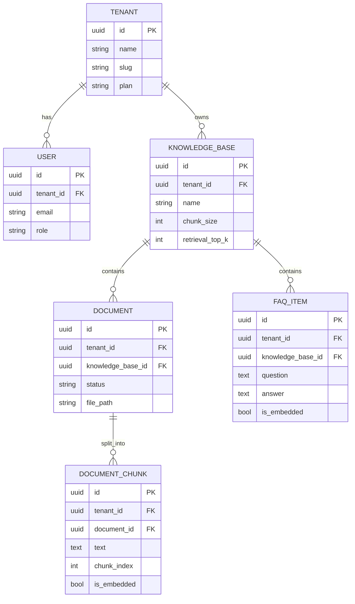

<div align="center">

# 🧠 RAG Platform

**Production-grade Multi-tenant Retrieval-Augmented Generation Platform**

[](https://python.org)
[](https://djangoproject.com)
[](https://react.dev)
[](https://typescriptlang.org)
[](https://tailwindcss.com)
[](https://qdrant.tech)
[]()
[](LICENSE)

A full-stack, multi-tenant RAG platform that turns documents, URLs, and FAQs into a searchable knowledge base with AI-powered question answering. Built with Django + React, powered by OpenAI embeddings and Claude / GPT-4o LLMs.

[Features](#-features) · [Architecture](#-architecture) · [Tech Stack](#-tech-stack) · [Quick Start](#-quick-start) · [API](#-api-overview) · [Testing](#-testing)

</div>

---

## ✨ Features

<table>
<tr>
<td width="50%">

**Knowledge Management**
- 📁 Upload PDF, DOCX, XLSX, PPTX, TXT, HTML, Markdown
- 🌐 Import web pages (static + Playwright dynamic rendering)
- ❓ FAQ management with bulk import
- 🔄 Automatic async ingestion pipeline
- ♻️ Per-KB reindex with embedding model switching + live progress

</td>
<td width="50%">

**AI-Powered Retrieval**
- 🔍 Vector similarity search (cosine, top-K)
- 🤖 Full RAG answers via Claude or GPT-4o
- 📊 Score-based relevance ranking
- 📝 Prompt builder with token estimation

</td>
</tr>
<tr>
<td>

**Multi-tenant & Secure**
- 🏢 Full tenant isolation at DB + Qdrant level
- 🔑 JWT authentication + API Key for agents
- 👥 Role-based access (owner / admin / member)
- 📋 Audit logs for every search & answer

</td>
<td>

**Developer Experience**
- 📖 Auto-generated Swagger / OpenAPI 3.0 docs
- ⚡ Celery async processing with Redis
- 🧪 27 pytest tests, all mocked externals
- 🐳 Docker-ready, `uv` package manager

</td>
</tr>
</table>

---

## 🏗 Architecture

### System Overview



---

### RAG Ingestion Pipeline



---

### RAG Query Flow



---

### Multi-tenant Data Isolation



---

## 🛠 Tech Stack

### Backend

| Layer | Technology | Purpose |
|-------|-----------|---------|
| Runtime | Python 3.13 + **uv** | Fast dependency management |
| Framework | **Django 6** + **DRF 3.16** | Web framework + REST APIs |
| Auth | **simplejwt** + API Key | JWT tokens + agent access |
| Task Queue | **Celery 5** + **Redis** | Async ingestion pipeline |
| Vector DB | **Qdrant 1.17** | Cosine similarity search |
| Object Storage | **MinIO** | Raw file storage (S3-compatible) |
| Database | **PostgreSQL** (schema: `rag`) | Structured data |
| Chunking | **LlamaIndex** `SentenceSplitter` / `SemanticSplitter` | Token-aware text splitting |
| Embedding | **OpenAI** `text-embedding-3-small` / `3-large` | Per-KB configurable, 1536 / 3072-dim |
| LLM | **Claude Sonnet 4.6** / **GPT-4o** | Answer generation |
| API Docs | **drf-spectacular** | OpenAPI 3.0 / Swagger |
| Document Parsing | pypdf · python-docx · openpyxl · python-pptx · BeautifulSoup4 | Multi-format support |

### Frontend

| Technology | Purpose |
|-----------|---------|
| **React 19** + **TypeScript 5.9** | UI framework |
| **Vite 7** | Build tool + dev proxy |
| **Redux Toolkit** + **RTK Query** | State management + data fetching |
| **React Router 7** | Client-side routing |
| **Ant Design 6** | UI components (tables, modals, forms) |
| **Tailwind CSS 4** | Dark theme + layout + utilities |

---

## 🚀 Quick Start

### Prerequisites

```bash
# Start infrastructure services
docker run -d -p 6333:6333 qdrant/qdrant
docker run -d -p 19000:9000 -e MINIO_ROOT_USER=admin -e MINIO_ROOT_PASSWORD=admin123 \
  minio/minio server /data --console-address ":9001"
redis-server --requirepass yourpassword
```

### Backend

```bash
cd backend

# Install dependencies (uv auto-creates virtualenv)
uv sync

# Configure environment
cp .env.example .env
# Edit .env: set DB credentials, OPENAI_KEY, ANTHROPIC_API_KEY, REDIS_URL

# Database setup
uv run python src/manage.py migrate
uv run python src/manage.py init_qdrant   # Create Qdrant collection
uv run python src/manage.py createsuperuser

# Run server
uv run python src/manage.py runserver     # http://localhost:8000

# Run Celery worker (separate terminal)
cd src && uv run celery -A config.celery worker --loglevel=info
```

### Frontend

```bash
cd frontend
npm install
npm run dev     # http://localhost:5173
```

> **Dev proxy**: All `/api/*` requests from `:5173` are automatically forwarded to `:8000` by Vite — no CORS config needed.

---

## 📁 Project Structure

```
rag/
├── backend/
│   ├── .env                      # All configuration
│   ├── pyproject.toml            # uv dependencies
│   └── src/
│       ├── config/
│       │   ├── settings/         # base / development / production
│       │   ├── api_router.py     # /api/v1/ route registration
│       │   └── celery.py         # Celery app
│       ├── apps/
│       │   ├── common/           # Base models, MinIO client, pagination
│       │   ├── tenants/          # Tenant model + TenantMiddleware
│       │   ├── accounts/         # User auth (JWT + API Key)
│       │   ├── knowledge_bases/  # KB CRUD
│       │   ├── documents/        # Upload, URL import, chunk preview
│       │   ├── faq/              # FAQ management + bulk import
│       │   ├── ingestion/        # Celery task orchestration
│       │   ├── parsers/          # PDF/DOCX/XLSX/PPTX/HTML parsers
│       │   ├── chunking/         # LlamaIndex SentenceSplitter / SemanticSplitter
│       │   ├── embeddings/       # OpenAI embedding service
│       │   ├── vector_store/     # Qdrant client wrapper
│       │   ├── retrieval/        # Search + prompt builder + RAG answer
│       │   └── audit/            # Search & query logs
│       └── tests/                # 27 pytest tests
│
├── frontend/
│   ├── .env                      # VITE_API_URL, VITE_APP_NAME
│   └── src/
│       ├── components/Layout/    # Collapsible sidebar + sticky header
│       ├── pages/                # Login, Dashboard, KB, Docs, FAQ,
│       │                         # Retrieval, Jobs, Logs
│       ├── store/
│       │   ├── api/              # RTK Query endpoints (4 APIs)
│       │   └── slices/authSlice  # JWT token management
│       └── index.css             # Tailwind v4 + Ant Design dark theme
│
└── docs/
    └── README.md                 # Full technical documentation (CN)
```

---

## 🔌 API Overview

All endpoints are prefixed with `/api/v1/`. Interactive docs at **`/api/schema/swagger-ui/`**.

### Authentication
```http
POST /auth/login/          # Returns access + refresh JWT
POST /auth/token/refresh/  # Refresh access token
GET  /auth/me/             # Current user info
```

### Tenant Settings
```http
GET   /tenants/settings/  # Get tenant-level defaults (embedding_model, llm_model)
PATCH /tenants/settings/  # Update tenant-level defaults
```

### Knowledge Bases
```http
GET    /knowledge-bases/            # List (paginated)
POST   /knowledge-bases/            # Create
PATCH  /knowledge-bases/{id}/       # Update settings
DELETE /knowledge-bases/{id}/       # Delete
POST   /knowledge-bases/{id}/rebuild/  # Async reindex with new embedding model
```

### Documents
```http
POST /knowledge-bases/{kbId}/documents/upload/       # Upload file (multipart)
POST /knowledge-bases/{kbId}/documents/import-url/   # Import URL
GET  /knowledge-bases/{kbId}/documents/{id}/chunks/  # Preview chunks
POST /knowledge-bases/{kbId}/documents/{id}/reindex/ # Re-trigger pipeline
```

### FAQ
```http
GET    /knowledge-bases/{kbId}/faq/               # List FAQ items
POST   /knowledge-bases/{kbId}/faq/               # Create (auto-embeds)
POST   /knowledge-bases/{kbId}/faq/bulk-import/   # Bulk import
PATCH  /knowledge-bases/{kbId}/faq/{id}/          # Update
DELETE /knowledge-bases/{kbId}/faq/{id}/          # Delete
```

### Retrieval & RAG

```http
POST /retrieval/search/  # Vector search — returns top-K chunks with scores
POST /rag/prompt/        # Build RAG prompt (no LLM call)
POST /rag/answer/        # Full RAG: retrieve + LLM → answer + sources
```

**Search request:**
```json
{
  "query": "What is RAG?",
  "knowledge_base_id": "uuid",
  "top_k": 5,
  "score_threshold": 0.0
}
```

**Answer request:**
```json
{
  "query": "What is RAG?",
  "knowledge_base_id": "uuid",
  "top_k": 5,
  "llm_model": "claude-sonnet-4-6"
}
```

**Answer response:**
```json
{
  "answer": "RAG (Retrieval-Augmented Generation) is...",
  "sources": [
    { "source": "intro.pdf · page 3", "score": 0.921 }
  ],
  "usage": { "prompt_tokens": 1240, "completion_tokens": 187, "total_tokens": 1427 },
  "latency_ms": 1267
}
```

---

## ⚙️ Configuration

### Backend `.env`

```ini
# Django
DJANGO_SETTINGS_MODULE=config.settings.development
SECRET_KEY=your-secret-key

# PostgreSQL
DB_HOST=localhost
DB_PORT=5432
DB_DATABASE=demo
DB_USER=postgres
DB_PASSWORD=yourpassword
DB_SCHEMA=rag

# MinIO
MINIO_URL=localhost:19000
MINIO_USER=admin
MINIO_PASSWORD=admin123
MINIO_BUCKET=rag-documents

# Qdrant
VDB_HOST=localhost
VDB_PORT=6333
QDRANT_COLLECTION=document_chunks

# Redis / Celery
REDIS_URL=redis://:yourpassword@localhost:6379/0

# AI Keys
OPENAI_KEY=sk-proj-...
ANTHROPIC_API_KEY=sk-ant-...
DEFAULT_LLM_MODEL=claude-sonnet-4-6
```

### Frontend `.env`

```ini
VITE_API_URL=http://localhost:8000
VITE_APP_NAME=RAG Platform
```

---

## 🧪 Testing

```bash
cd backend

# Run all 27 tests
uv run pytest

# With reuse-db (faster on re-runs)
uv run pytest --reuse-db

# Specific file
uv run pytest src/tests/test_retrieval.py -v

# With coverage
uv run pytest --cov=apps --cov-report=html
```

**Test strategy:**
- External services (MinIO, Qdrant, LLMs, background tasks) are all **mocked** — tests run without any infrastructure
- Real PostgreSQL is used with a `test_` prefixed database
- `conftest.py` auto-creates the `rag` schema if missing

```
✓ test_auth.py            — login, token refresh, protected endpoints
✓ test_knowledge_bases.py — CRUD, tenant isolation
✓ test_documents.py       — upload, URL import, chunk preview
✓ test_faq.py             — create, list, delete, bulk import
✓ test_retrieval.py       — vector search, RAG answer, error handling

27 passed in 4.5s
```

---

## 🐳 Docker

```bash
# Build images
docker build -t rag-backend  ./backend
docker build -t rag-frontend ./frontend

# Run backend (point to your infra)
docker run -d --env-file backend/.env -p 8000:8000 rag-backend

# Run frontend
docker run -d -p 80:80 rag-frontend
```

---

## 📖 Pages

| Page | Route | Description |
|------|-------|-------------|
| **Login** | `/login` | Email + password, JWT stored in localStorage |
| **Dashboard** | `/dashboard` | Stats overview, KB summary, quick actions |
| **Knowledge Bases** | `/knowledge-bases` | Create/edit KBs, configure chunk size & top-K, reindex with model switching |
| **Documents** | `/knowledge-bases/:id/documents` | Upload files, import URLs, preview chunks |
| **FAQ** | `/knowledge-bases/:id/faq` | Manage Q&A pairs, view embedding status |
| **Retrieval Test** | `/retrieval` | Test vector search and RAG answers interactively |
| **Jobs** | `/jobs` | Monitor ingestion pipeline progress per document |
| **Logs** | `/logs` | Retrieval logs and RAG query logs with latency |

---

## 📄 License

MIT License — see [LICENSE](LICENSE) for details.

---

<div align="center">

Built with Django · React · Qdrant · OpenAI · Anthropic · Tailwind CSS

</div>
